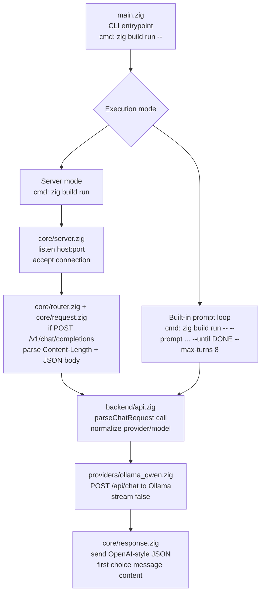

# Zig Coding Agent

OpenAI-compatible Zig server for local model routing. The current default path
uses Ollama and exposes `POST /v1/chat/completions` for chat-style requests.

> [!TIP]
> **TL;DR:** Prompt looping is built in. Start here:
> `zig build run -- --prompt "Work through this task step by step and end with DONE" --provider ollama`
>
> See [Prompt Loop (Built-In, Recommended)](#prompt-loop-built-in-recommended) for controls like `--until` and `--max-turns`.

## Requirements

- Zig `0.15.2`
- Ollama running locally
- A local model available in Ollama, default `qwen:7b`

## Project Layout

- `src/main.zig`: minimal CLI entrypoint
- `src/root.zig`: public module surface and re-exports
- `src/backend/`: request parsing, provider dispatch, shared API errors
- `src/core/`: HTTP server, routing, request parsing, and response formatting
- `src/providers/`: provider-specific implementation(s)

## Architecture

High-level request flow:



## Configuration

Use environment variables to configure the server:

- `LLM_ROUTER_HOST`: default `127.0.0.1`
- `LLM_ROUTER_PORT`: default `8081`
- `LLM_ROUTER_DEBUG`: default `0`
- `LLM_ROUTER_PROVIDER`: default `ollama`
- `OLLAMA_BASE_URL`: default `http://127.0.0.1:11434`
- `OLLAMA_MODEL`: default `qwen:7b`
- `OPENROUTER_BASE_URL`: default `https://openrouter.ai/api/v1`
- `OPENROUTER_API_KEY`: default empty
- `OPENROUTER_HTTP_REFERER`: default empty
- `OPENROUTER_APP_NAME`: default empty
- `OPENROUTER_MODEL`: default `openrouter/auto`
- `BEDROCK_RUNTIME_BASE_URL`: optional override for the regional runtime endpoint
- `BEDROCK_REGION`: default `us-east-1`, with fallbacks from `AWS_REGION` or `AWS_DEFAULT_REGION`
- `BEDROCK_ACCESS_KEY_ID`: falls back to `AWS_ACCESS_KEY_ID`
- `BEDROCK_SECRET_ACCESS_KEY`: falls back to `AWS_SECRET_ACCESS_KEY`
- `BEDROCK_SESSION_TOKEN`: falls back to `AWS_SESSION_TOKEN`
- `BEDROCK_MODEL`: default `amazon.nova-micro-v1:0`
- `LLM_ROUTER_SESSION_STORE_PATH`: default `logs/sessions` (set empty to disable persistence)
- `LLM_ROUTER_SESSION_RETENTION_MESSAGES`: default `24`
- `LLM_ROUTER_TOOL_EXEC_ENABLED`: default `0` (set `1` to enable `cmd`/`bash` debug tools)
- `LLM_ROUTER_TOOL_EXEC_MAX_OUTPUT_BYTES`: default `65536`
- `LLM_ROUTER_LOOP_STREAM_PROGRESS_ENABLED`: default `1` (set `0` to stream only the final loop result)

You can also override the default provider at startup:

```bash
zig build run -- --provider ollama
```

Supported provider values are:

- `ollama`, `qwen`, `ollama_qwen`
- `openai`
- `openrouter`
- `claude`, `anthropic`
- `bedrock`
- `llama_cpp`, `llama.cpp`
CLI dotenv loading (optional):

```bash
zig build run -- --use-env
# or
zig build run -- --env-file=.env.local
```

Supported provider values are `ollama`, `qwen`, and `ollama_qwen`.

You can run an in-project prompt loop (no external shell loop required):

```bash
zig build run -- --prompt "Draft a short API summary and end with DONE" --provider ollama
```

Optional loop controls:

- `--until <marker>`: completion marker to stop on (default `DONE`)
- `--max-turns <n>`: hard stop to prevent infinite loops (default `8`)
- `--loop-mode <basic|agent>`: choose simple continuation or iterative agent refinement (default `basic`)
- `--agent-loop`: shorthand for `--loop-mode=agent`

Example with explicit controls:

```bash
zig build run -- --prompt "Plan a migration and end with FINISHED" --provider ollama --until FINISHED --max-turns 12
```

## Agent Loop (Small-Model Mode)

Use `agent` loop mode when your goal is to get stronger final quality from a smaller model through iterative refinement.

What changes in `agent` mode:

- adds loop-specific system guidance for iterative improvement
- asks the model to self-critique and improve each turn
- stops early when the model repeats output without progress

Recommended command:

```bash
zig build run -- --use-env --loop-mode=agent --provider ollama --prompt "Solve the task step by step and include DONE only when fully complete." --until DONE --max-turns 12
```

Important: app flags must come after the extra `--` separator (`zig build run -- --use-env ...`).

Frontend/API usage (frontend-independent):

- `loop_mode`: `basic` or `agent`
- `loop_until`: completion marker (for example `DONE`)
- `loop_max_turns`: max in-request loop turns

When `stream: true` is combined with loop fields, the server can emit per-turn loop progress chunks.
Control this with `LLM_ROUTER_LOOP_STREAM_PROGRESS_ENABLED`:

- `1` (default): emit loop progress chunks plus final stop chunk
- `0`: suppress loop progress chunks and emit only final result chunks

Example payload:

```json
{
  "provider": "ollama",
  "messages": [{"role": "user", "content": "Solve this task and include DONE when complete."}],
  "loop_mode": "agent",
  "loop_until": "DONE",
  "loop_max_turns": 12
}
```

## Build And Run

```bash
zig build
zig build run
zig build check
```

Command summary:

- `zig build`: build and install to `zig-out/` (default step)
- `zig build run -- [args]`: run the server executable
- `zig build check`: compile app and built-in test modules without running
- `zig build test ...`: run tests with selectable targets

## Testing

Run every built-in test target:

```bash
zig build test -Dtest-target=all
```

Run only the package/module tests exported through [src/root.zig](src/root.zig):

```bash
zig build test -Dtest-target=root
```

Run only the focused `types` tests:

```bash
zig build test -Dtest-target=types
```

Run tests from one specific file:

```bash
zig build test -Dtest-target=file "-Dtest-file=src/types.zig"
```

Filter tests by name across any target:

```bash
zig build test -Dtest-target=all -Dtest-filter=normalizeProviderName
```

Manual integration check against the local router:

1. Start the server:

   ```bash
   zig build run
   ```

2. In another terminal, send an OpenAI-compatible request without a `provider`
   field. This verifies the router, request parsing, default provider lookup,
   and the Ollama round-trip:

   ```bash
   curl -s http://127.0.0.1:8081/v1/chat/completions \
     -H 'Content-Type: application/json' \
     -d '{"messages":[{"role":"user","content":"Say hello from local Qwen"}]}'
   ```

3. If you want to confirm provider selection explicitly, repeat the request
   with `provider` set to one of the supported aliases:

   ```bash
   curl -s http://127.0.0.1:8081/v1/chat/completions \
     -H 'Content-Type: application/json' \
     -d '{"provider":"ollama","messages":[{"role":"user","content":"Say hello from local Qwen"}]}'
   ```

4. OpenRouter example:

   ```bash
   curl -s http://127.0.0.1:8081/v1/chat/completions \
     -H 'Content-Type: application/json' \
     -d '{"provider":"openrouter","model":"openrouter/auto","messages":[{"role":"user","content":"Say hello from OpenRouter"}]}'
   ```

5. Bedrock example:

   ```bash
   curl -s http://127.0.0.1:8081/v1/chat/completions \
     -H 'Content-Type: application/json' \
     -d '{"provider":"bedrock","model":"amazon.nova-micro-v1:0","messages":[{"role":"user","content":"Say hello from Bedrock"}]}'
   ```

Optional dependency sanity check for Ollama itself:

```bash
curl -s http://127.0.0.1:11434/api/chat \
  -H 'Content-Type: application/json' \
  -d '{"model":"qwen:7b","messages":[{"role":"user","content":"Say hello from Zig"}],"stream":false}'
```

## Prompt Loop (Built-In, Recommended)

Looping is built in now. Most users should use the CLI prompt loop instead of
writing shell scripts.

Quick start:

```bash
zig build run -- --prompt "Work through this task step by step and end with DONE" --provider ollama
```

Recommended controls:

- `--until <marker>`: stop once the model includes this marker (default `DONE`)
- `--max-turns <n>`: hard stop for safety (default `8`)

Example with explicit controls:

```bash
zig build run -- --prompt "Plan the refactor and end with FINISHED" --provider ollama --until FINISHED --max-turns 12
```

When to use this mode:

- You want multi-turn progress on one task.
- You want conversation state handled for you.
- You want a reliable stop condition without custom scripting.

Single-response mode is still available through normal
`POST /v1/chat/completions` requests.

## External Prompt Looping (Optional Advanced Path)

Only use external bash/Python loops if you need custom orchestration outside the
built-in behavior (for example, custom persistence, retries, or telemetry).

Reference bash pattern:

```bash
messages='[{"role":"user","content":"Work through this task one step at a time. End with DONE when finished: <your prompt>"}]'

while true; do
  body=$(printf '{"messages":%s}' "$messages")
  response=$(curl -s http://127.0.0.1:8081/v1/chat/completions \
    -H 'Content-Type: application/json' \
    -d "$body")

  assistant=$(printf '%s' "$response" | jq -r '.choices[0].message.content')
  finish_reason=$(printf '%s' "$response" | jq -r '.choices[0].finish_reason')

  printf '%s\n' "$assistant"

  messages=$(printf '%s' "$messages" | jq --arg content "$assistant" \
    '. + [{role:"assistant", content:$content}]')

  if printf '%s' "$assistant" | grep -Eq '(^|[[:space:]])DONE([[:space:]]|$)' || [ "$finish_reason" = "stop" ]; then
    break
  fi

  messages=$(printf '%s' "$messages" | jq '. + [{role:"user", content:"Continue."}]')
done
```

## Request Shape

The server accepts the OpenAI-style chat-completions payload used by the
router. Requests may include a `provider` field, but if they do not, the
configured default provider is used instead.

Example request:

```bash
curl -s http://127.0.0.1:8081/v1/chat/completions \
 -H 'Content-Type: application/json' \
 -d '{"messages":[{"role":"user","content":"Say hello from local Qwen"}]}'
```

Stateful session request example (history survives restarts when persistence is enabled):

```bash
curl -s http://127.0.0.1:8081/v1/chat/completions \
 -H 'Content-Type: application/json' \
 -d '{"session_id":"demo-1","messages":[{"role":"user","content":"Remember that my favorite color is green."}]}'
```

Legacy provider values are still accepted: `ollama`, `qwen`, and
`ollama_qwen`.
