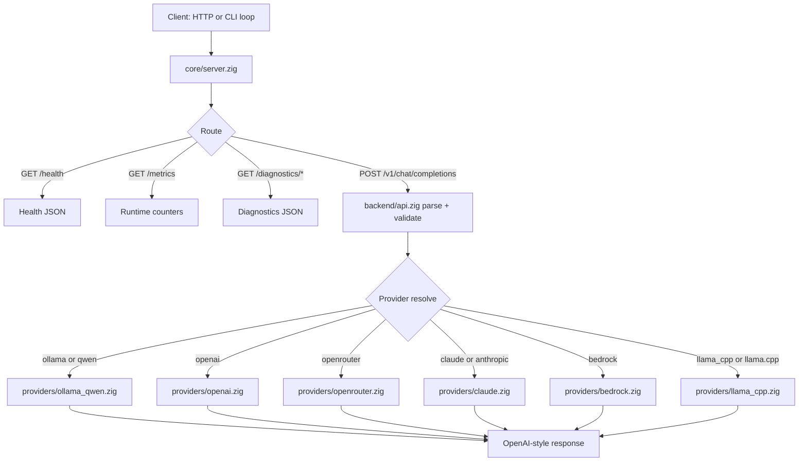

# Zig Coding Agent

OpenAI-compatible LLM router and prompt-loop runtime written in Zig.

This project exposes a chat-completions API, routes requests across multiple providers, supports optional streaming, and includes built-in loop controls for iterative agent workflows.

> [!TIP]
> Fastest local smoke test:
>
> 1. Start the server: zig build run
> 2. Call health: curl -s <http://127.0.0.1:8081/health>
> 3. Send one chat request to POST /v1/chat/completions

## Why This Project

- OpenAI-compatible request and response shape for chat-completions clients.
- Provider routing behind one endpoint with alias normalization.
- CLI and request-level loop primitives for multi-turn agent execution.
- Optional debug tooling (echo, utc, cmd, bash) with safe defaults.
- Simple deploy surface: single Zig binary, environment-based configuration.

## Architecture



## Requirements

- Zig 0.15.2
- Network access to whichever provider endpoints you configure
- Provider credentials for non-local providers

## Build, Run, and Test

```bash
zig build
zig build run
zig build check
```

### Test Targets

```bash
# All built-in targets
zig build test -Dtest-target=all

# Root modules only
zig build test -Dtest-target=root

# Focused types tests
zig build test -Dtest-target=types

# Single file tests
zig build test -Dtest-target=file "-Dtest-file=src/types.zig"

# Optional name filter
zig build test -Dtest-target=all -Dtest-filter=normalizeProviderName
```

## API Surface

### Endpoints

| Method | Path                   | Auth Required               | Description                           |
| ------ | ---------------------- | --------------------------- | ------------------------------------- |
| GET    | /health                | No                          | Basic readiness and instance identity |
| GET    | /metrics               | Yes (if API key configured) | Request and connection counters       |
| GET    | /diagnostics/clients   | Yes (if API key configured) | Connected client diagnostics          |
| GET    | /diagnostics/requests  | Yes (if API key configured) | Request success/failure diagnostics   |
| GET    | /diagnostics/providers | No                          | Provider status snapshot              |
| POST   | /v1/chat/completions   | Yes (if API key configured) | OpenAI-compatible chat-completions    |

> [!NOTE]
> Authentication is enabled when LLM_ROUTER_API_KEY is non-empty. When enabled, all routes require auth except /health and /diagnostics/providers.

### Chat Request Shape

At least one of messages or prompt is required, but not both.

```json
{
  "messages": [{ "role": "user", "content": "Hello" }],
  "provider": "ollama",
  "model": "auto",
  "stream": false,
  "think": true,
  "temperature": 0.7,
  "repeat_penalty": 1.05,
  "session_id": "session-123",
  "tenant_id": "tenant-a",
  "max_context_tokens": 4096,
  "tools": [{ "name": "utc", "description": "Current UTC time" }],
  "tool_choice": "auto",
  "loop_mode": "agent",
  "loop_until": "DONE",
  "loop_max_turns": 8
}
```

Supported message roles: system, user, assistant, tool.

### Streaming

- stream=true is currently supported only for the Ollama path (ollama, qwen, ollama_qwen).
- Non-Ollama streaming requests are rejected with a validation error.

## Providers

Canonical provider IDs and accepted aliases:

| Canonical   | Accepted Aliases          |
| ----------- | ------------------------- |
| ollama_qwen | ollama_qwen, ollama, qwen |
| openai      | openai                    |
| openrouter  | openrouter                |
| claude      | claude, anthropic         |
| bedrock     | bedrock                   |
| llama_cpp   | llama_cpp, llama.cpp      |

Provider status diagnostics currently report status for:

- ollama
- openrouter
- bedrock

## CLI Prompt Loop

Run one-off iterative loops without writing a shell script:

```bash
zig build run -- --prompt "Work through the task and end with DONE" --provider ollama
```

Loop controls:

- --prompt <text> initial prompt and loop entry
- --provider <name> provider override
- --until <marker> completion marker (default: DONE)
- --max-turns <n> loop safety cap (default: 8)
- --loop-mode <basic|agent> loop style
- --agent-loop shorthand for agent mode
- --use-env load .env
- --env-file <path> load a custom dotenv file

## Tools

Registered tool names:

- echo
- utc
- cmd
- bash

Tool behavior summary:

- echo and utc are deterministic debug helpers.
- cmd and bash are guarded command-execution tools.
- Command execution is disabled by default and must be explicitly enabled.

```bash
# Enable command tools explicitly (use only in trusted environments)
set LLM_ROUTER_TOOL_EXEC_ENABLED=1
```

Related limits:

- LLM_ROUTER_TOOL_EXEC_TIMEOUT_MS (default: 15000)
- LLM_ROUTER_TOOL_EXEC_MAX_OUTPUT_BYTES (default: 65536)

## Configuration Reference

### Core Server

| Variable                                | Default        |
| --------------------------------------- | -------------- |
| LLM_ROUTER_HOST                         | 127.0.0.1      |
| LLM_ROUTER_PORT                         | 8081           |
| LLM_ROUTER_DEBUG                        | 0              |
| LLM_ROUTER_PROVIDER                     | ollama         |
| LLM_ROUTER_INSTANCE_ID                  | local-instance |
| LLM_ROUTER_API_KEY                      | empty          |
| LLM_ROUTER_REQUEST_TIMEOUT_MS           | 30000          |
| LLM_ROUTER_PROVIDER_TIMEOUT_MS          | 60000          |
| LLM_ROUTER_LOOP_STREAM_PROGRESS_ENABLED | true           |

### Session Storage

| Variable                              | Default       |
| ------------------------------------- | ------------- |
| LLM_ROUTER_SESSION_STORE_PATH         | logs/sessions |
| LLM_ROUTER_SESSION_RETENTION_MESSAGES | 24            |

### Ollama

| Variable              | Default                  |
| --------------------- | ------------------------ |
| OLLAMA_BASE_URL       | <http://127.0.0.1:11434> |
| OLLAMA_MODEL          | qwen3.5:9b               |
| OLLAMA_THINK          | 0                        |
| OLLAMA_NUM_PREDICT    | 128                      |
| OLLAMA_TEMPERATURE    | 0.7                      |
| OLLAMA_REPEAT_PENALTY | 1.05                     |

### OpenAI

| Variable        | Default                     |
| --------------- | --------------------------- |
| OPENAI_BASE_URL | <https://api.openai.com/v1> |
| OPENAI_API_KEY  | empty                       |
| OPENAI_MODEL    | gpt-4.1-mini                |

### OpenRouter

| Variable                | Default                        |
| ----------------------- | ------------------------------ |
| OPENROUTER_BASE_URL     | <https://openrouter.ai/api/v1> |
| OPENROUTER_API_KEY      | empty                          |
| OPENROUTER_HTTP_REFERER | empty                          |
| OPENROUTER_APP_NAME     | empty                          |
| OPENROUTER_MODEL        | openrouter/auto                |

### Claude

| Variable        | Default                        |
| --------------- | ------------------------------ |
| CLAUDE_BASE_URL | <https://api.anthropic.com/v1> |
| CLAUDE_API_KEY  | empty                          |
| CLAUDE_MODEL    | claude-3-5-sonnet-latest       |

### Bedrock

| Variable                  | Default                |
| ------------------------- | ---------------------- |
| BEDROCK_RUNTIME_BASE_URL  | empty                  |
| BEDROCK_REGION            | us-east-1              |
| BEDROCK_ACCESS_KEY_ID     | empty                  |
| BEDROCK_SECRET_ACCESS_KEY | empty                  |
| BEDROCK_SESSION_TOKEN     | empty                  |
| BEDROCK_MODEL             | amazon.nova-micro-v1:0 |

### llama.cpp

| Variable           | Default                 |
| ------------------ | ----------------------- |
| LLAMA_CPP_BASE_URL | <http://127.0.0.1:8080> |
| LLAMA_CPP_API_KEY  | empty                   |
| LLAMA_CPP_MODEL    | local-model             |

## Manual Verification

1. Start Server

   ```bash
   zig build run
   ```

2. Health Check

   ```bash
   curl -s http://127.0.0.1:8081/health
   ```

3. Chat Completion Check

   ```bash
   curl -s http://127.0.0.1:8081/v1/chat/completions \
   -H "Content-Type: application/json" \
   -d '{"messages":[{"role":"user","content":"Say hello from zig-coding-agent"}]}'
   ```

4. Provider Diagnostics

   ```bash
   curl -s http://127.0.0.1:8081/diagnostics/providers
   ```

## Project Layout

```
zig_coding_agent
├── .gitignore
├── README.md
├── build.zig
├── build.zig.zon
└── src
    ├── backend
    │   ├── api.zig
    │   ├── auth.zig
    │   ├── errors.zig
    │   ├── session.zig
    │   └── tools.zig
    ├── config.zig
    ├── core
    │   ├── request.zig
    │   ├── response.zig
    │   ├── router.zig
    │   └── server.zig
    ├── main.zig
    ├── providers
    │   ├── bedrock.zig
    │   ├── claude.zig
    │   ├── llama_cpp.zig
    │   ├── ollama_qwen.zig
    │   ├── openai.zig
    │   ├── openai_compatible.zig
    │   └── openrouter.zig
    ├── root.zig
    ├── tools
    │   ├── command_exec.zig
    │   ├── echo.zig
    │   └── utc.zig
    └── types.zig
```
