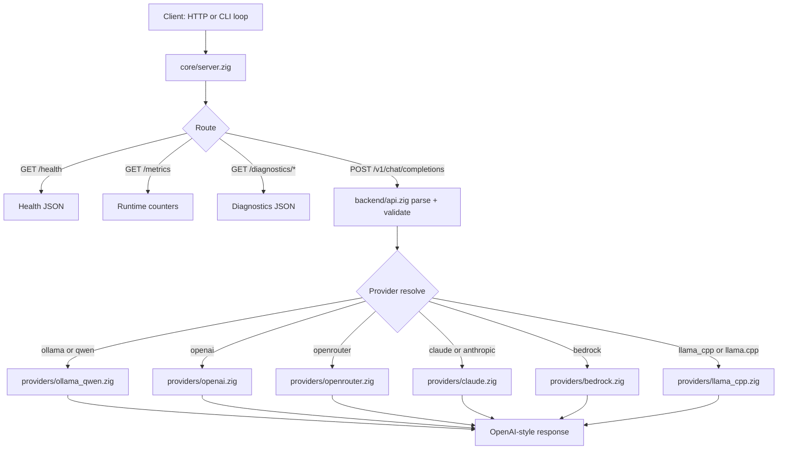

# Zig Coding Agent

OpenAI-compatible LLM router and prompt-loop runtime written in Zig.

This project exposes a chat-completions API, routes requests across multiple providers, supports optional streaming, and includes built-in loop controls for iterative agent workflows. Scope: **thin, reliable model harness** (see `phase.md` Phase 0 and `plan.md` for the frozen feature set and deferrals).

> [!TIP]
> Fastest local smoke test:
>
> 1. Start the server: zig build run
> 2. Call health: curl -s <http://127.0.0.1:8081/health>
> 3. Send one chat request to POST /v1/chat/completions

## Why This Project

- OpenAI-compatible request and response shape for chat-completions clients.
- Provider routing behind one endpoint with alias normalization.
- CLI and request-level loop primitives for multi-turn agent execution.
- Optional debug tooling (echo, utc, cmd, bash) with safe defaults.
- Tool declarations with optional JSON Schema input metadata for compatible providers.
- Simple deploy surface: single Zig binary, environment-based configuration.


## Architecture


```mermaid
flowchart TD
 A[Client: HTTP or CLI loop] --> B[core/server.zig]
 B --> C{Route}
 C -->|GET /health| D[Health JSON]
 C -->|GET /metrics| E[Runtime counters]
 C -->|GET /diagnostics/*| F[Diagnostics JSON]
 C -->|POST /v1/chat/completions| G[backend/api.zig parse + validate]

 G --> H{Provider resolve}
 H -->|ollama or qwen| I[providers/ollama_qwen.zig]
 H -->|openai| J[providers/openai.zig]
 H -->|openrouter| K[providers/openrouter.zig]
 H -->|claude or anthropic| L[providers/claude.zig]
 H -->|bedrock| M[providers/bedrock.zig]
 H -->|llama_cpp or llama.cpp| N[providers/llama_cpp.zig]

 I --> O[OpenAI-style response]
 J --> O
 K --> O
 L --> O
 M --> O
 N --> O
```

## Requirements

- Zig 0.15.2
- Network access to whichever provider endpoints you configure
- Provider credentials for non-local providers

## Build, Run, and Test

```bash
zig build
zig build run
zig build check
```

### Test Targets

```bash
# All built-in targets
zig build test -Dtest-target=all

# Root modules only
zig build test -Dtest-target=root

# Focused types tests
zig build test -Dtest-target=types

# Single file tests
zig build test -Dtest-target=file "-Dtest-file=src/types.zig"

# Optional name filter
zig build test -Dtest-target=all -Dtest-filter=normalizeProviderName
```

## API Surface

### Endpoints

| Method | Path                   | Auth Required               | Description                           |
| ------ | ---------------------- | --------------------------- | ------------------------------------- |
| GET    | /health                | No                          | Basic readiness and instance identity |
| GET    | /metrics               | Yes (if API key configured) | Request and connection counters       |
| GET    | /diagnostics/clients   | Yes (if API key configured) | Connected client diagnostics          |
| GET    | /diagnostics/requests  | Yes (if API key configured) | Request success/failure diagnostics   |
| GET    | /diagnostics/providers | Yes (if API key configured) | Provider status snapshot              |
| POST   | /v1/chat/completions   | Yes (if API key configured) | OpenAI-compatible chat-completions    |

> [!NOTE]
> Authentication is enabled when LLM_ROUTER_API_KEY is non-empty. When enabled, all routes require auth except /health.

### Chat Request Shape

At least one of messages or prompt is required, but not both.

```json
{
  "messages": [{ "role": "user", "content": "Hello" }],
  "provider": "ollama",
  "model": "auto",
  "stream": false,
  "think": true,
  "temperature": 0.7,
  "repeat_penalty": 1.05,
  "session_id": "session-123",
  "tenant_id": "tenant-a",
  "max_context_tokens": 4096,
  "tools": [
    {
      "name": "utc",
      "description": "Current UTC time",
      "input_schema": "{\"type\":\"object\",\"properties\":{},\"additionalProperties\":false}"
    }
  ],
  "tool_choice": "auto",
  "loop_mode": "agent",
  "loop_until": "DONE",
  "loop_max_turns": 8
}
```

Supported message roles: system, user, assistant, tool.

Tool declarations require a unique name and may include description plus schema metadata. The schema is supplied as a JSON string in input_schema, parameters, or schema; the router validates that the string is valid JSON and renders it as function parameters for Ollama and OpenAI-compatible providers. tool_choice accepts auto, none, required, or the name of a requested tool.

### Streaming

- stream=true is currently supported only for the Ollama path (ollama, qwen, ollama_qwen).
- Non-Ollama streaming requests are rejected with a validation error.

## Providers

Canonical provider IDs and accepted aliases:

| Canonical   | Accepted Aliases          |
| ----------- | ------------------------- |
| ollama_qwen | ollama_qwen, ollama, qwen |
| openai      | openai                    |
| openrouter  | openrouter                |
| claude      | claude, anthropic         |
| bedrock     | bedrock                   |
| llama_cpp   | llama_cpp, llama.cpp      |

Provider status diagnostics currently report status for:

- ollama
- openrouter
- bedrock

## CLI Prompt Loop

Run one-off iterative loops without writing a shell script:

```bash
zig build run -- --prompt "Work through the task and end with DONE" --provider ollama
```

Loop controls:

- --prompt <text> initial prompt and loop entry
- --provider <name> provider override
- --until <marker> completion marker (default: DONE)
- --max-turns <n> loop safety cap (default: 8)
- --loop-mode <basic|agent|react> loop style
- --agent-loop shorthand for agent mode
- --react shorthand for ReAct reasoning mode
- --use-env load .env
- --env-file <path> load a custom dotenv file

## ReAct Mode

ReAct (Reasoning + Acting) mode implements the paradigm from [Yao et al., 2022](https://arxiv.org/abs/2210.03629). The model produces structured **Thought → Action** pairs, and the system executes each action and injects the result as an **Observation** before the next turn.

### Available Actions

| Action | Description | Requirements |
| --------- | -------------------------------- | --------------------------------------- |
| Search[q] | Search for information (stub) | None (future: wire to search tool/API) |
| Lookup[t] | Look up a term in context (stub) | None (future: wire to retrieval backend) |
| Cmd[c]    | Execute a shell command           | `LLM_ROUTER_TOOL_EXEC_ENABLED=1`       |
| Finish[a] | Return final answer and stop loop | None                                    |

> [!NOTE]
> Search and Lookup return stub responses. They are designed as extension points for future tool/API integration.

### CLI Example

```bash
zig build run -- --react --prompt "What is the elevation range of the High Plains?" --provider ollama
```

### API Example

```json
{
  "messages": [{ "role": "user", "content": "What is the elevation range of the High Plains?" }],
  "loop_mode": "react",
  "loop_max_turns": 10
}
```

The model will produce output like:

```
Thought 1: I need to search for the High Plains elevation range.
Action 1: Search[High Plains elevation]
```

The system injects:

```
Observation 1: <result from action execution>
```

This continues until the model emits `Action N: Finish[answer]` or the turn budget is exhausted.

## Tools

Registered tool names:

- echo
- utc
- cmd
- bash
- file_read
- file_write
- file_search

Tool behavior summary:

- echo and utc are deterministic debug helpers.
- cmd and bash are guarded command-execution tools.
- file_read, file_write, and file_search are lightweight filesystem helpers for trusted local workflows.
- Command execution is disabled by default and must be explicitly enabled.

```bash
# Enable command tools explicitly (use only in trusted environments)
set LLM_ROUTER_TOOL_EXEC_ENABLED=1
```

Related limits:

- LLM_ROUTER_TOOL_EXEC_TIMEOUT_MS (default: 15000)
- LLM_ROUTER_TOOL_EXEC_MAX_OUTPUT_BYTES (default: 65536)
- LLM_ROUTER_MAX_TOOL_CALLS_PER_REQUEST (default: 8)

## Configuration Reference

### Core Server

| Variable                                | Default        |
| --------------------------------------- | -------------- |
| LLM_ROUTER_HOST                         | 127.0.0.1      |
| LLM_ROUTER_PORT                         | 8081           |
| LLM_ROUTER_DEBUG                        | 0              |
| LLM_ROUTER_PROVIDER                     | ollama         |
| LLM_ROUTER_INSTANCE_ID                  | local-instance |
| LLM_ROUTER_API_KEY                      | empty          |
| LLM_ROUTER_REQUEST_TIMEOUT_MS           | 30000          |
| LLM_ROUTER_PROVIDER_TIMEOUT_MS          | 60000          |
| LLM_ROUTER_LOOP_STREAM_PROGRESS_ENABLED | true           |
| LLM_ROUTER_MAX_CONCURRENT_CONNECTIONS   | 64             |
| LLM_ROUTER_MAX_REQUEST_BYTES            | 1048576        |
| LLM_ROUTER_MAX_HEADER_BYTES             | 16384          |

### Session Storage

| Variable                              | Default       |
| ------------------------------------- | ------------- |
| LLM_ROUTER_SESSION_STORE_PATH         | logs/sessions |
| LLM_ROUTER_SESSION_RETENTION_MESSAGES | 24            |

### Ollama

| Variable              | Default                  |
| --------------------- | ------------------------ |
| OLLAMA_BASE_URL       | <http://127.0.0.1:11434> |
| OLLAMA_MODEL          | qwen3.5:9b               |
| OLLAMA_THINK          | 0                        |
| OLLAMA_NUM_PREDICT    | 128                      |
| OLLAMA_TEMPERATURE    | 0.7                      |
| OLLAMA_REPEAT_PENALTY | 1.05                     |

### OpenAI

| Variable        | Default                     |
| --------------- | --------------------------- |
| OPENAI_BASE_URL | <https://api.openai.com/v1> |
| OPENAI_API_KEY  | empty                       |
| OPENAI_MODEL    | gpt-4.1-mini                |

### OpenRouter

| Variable                | Default                        |
| ----------------------- | ------------------------------ |
| OPENROUTER_BASE_URL     | <https://openrouter.ai/api/v1> |
| OPENROUTER_API_KEY      | empty                          |
| OPENROUTER_HTTP_REFERER | empty                          |
| OPENROUTER_APP_NAME     | empty                          |
| OPENROUTER_MODEL        | openrouter/auto                |

### Claude

| Variable        | Default                        |
| --------------- | ------------------------------ |
| CLAUDE_BASE_URL | <https://api.anthropic.com/v1> |
| CLAUDE_API_KEY  | empty                          |
| CLAUDE_MODEL    | claude-3-5-sonnet-latest       |

### Bedrock

| Variable                  | Default                |
| ------------------------- | ---------------------- |
| BEDROCK_RUNTIME_BASE_URL  | empty                  |
| BEDROCK_REGION            | us-east-1              |
| BEDROCK_ACCESS_KEY_ID     | empty                  |
| BEDROCK_SECRET_ACCESS_KEY | empty                  |
| BEDROCK_SESSION_TOKEN     | empty                  |
| BEDROCK_MODEL             | amazon.nova-micro-v1:0 |

### llama.cpp

| Variable           | Default                 |
| ------------------ | ----------------------- |
| LLAMA_CPP_BASE_URL | <http://127.0.0.1:8080> |
| LLAMA_CPP_API_KEY  | empty                   |
| LLAMA_CPP_MODEL    | local-model             |

## Manual Verification

1. Start Server

   ```bash
   zig build run
   ```

2. Health Check

   ```bash
   curl -s http://127.0.0.1:8081/health
   ```

3. Chat Completion Check

   ```bash
   curl -s http://127.0.0.1:8081/v1/chat/completions \
   -H "Content-Type: application/json" \
   -d '{"messages":[{"role":"user","content":"Say hello from zig-coding-agent"}]}'
   ```

4. Stateful Session Check

   ```bash
   curl -s http://127.0.0.1:8081/v1/chat/completions \
   -H "Content-Type: application/json" \
   -d '{"session_id":"demo-session","messages":[{"role":"user","content":"Remember that my test color is blue."}]}'
   ```

5. Tool Check

   ```bash
   curl -s http://127.0.0.1:8081/v1/chat/completions \
   -H "Content-Type: application/json" \
   -d '{"messages":[{"role":"user","content":"What time is it in UTC?"}],"tools":[{"name":"utc","description":"Current UTC time"}],"tool_choice":"auto"}'
   ```

6. Provider Diagnostics

   ```bash
   curl -s http://127.0.0.1:8081/diagnostics/providers
   ```

## Short Runbook

- 401 Unauthorized: set `LLM_ROUTER_API_KEY` on the server and send either `X-Api-Key: <key>` or `Authorization: Bearer <key>`.
- 413 request_too_large: lower the prompt size or raise `LLM_ROUTER_MAX_REQUEST_BYTES` for trusted deployments.
- 504 provider_timeout: check provider reachability and `LLM_ROUTER_PROVIDER_TIMEOUT_MS`.
- unknown_tool: request only registered tools listed above.
- provider_not_configured: set the provider API key or switch to a local provider.

## Project Layout

```
zig_coding_agent
├── .gitignore
├── README.md
├── build.zig
├── build.zig.zon
└── src
    ├── backend
    │   ├── api.zig
    │   ├── auth.zig
    │   ├── errors.zig
    │   ├── mcp.zig
    │   ├── session.zig
    │   └── tools.zig
    ├── config.zig
    ├── core
    │   ├── request.zig
    │   ├── response.zig
    │   ├── router.zig
    │   └── server.zig
    ├── main.zig
    ├── providers
    │   ├── bedrock.zig
    │   ├── claude.zig
    │   ├── llama_cpp.zig
    │   ├── ollama_qwen.zig
    │   ├── openai.zig
    │   ├── openai_compatible.zig
    │   └── openrouter.zig
    ├── react.zig
    ├── root.zig
    ├── tools
    │   ├── command_exec.zig
    │   ├── echo.zig
    │   ├── file_ops.zig
    │   └── utc.zig
    └── types.zig
```
